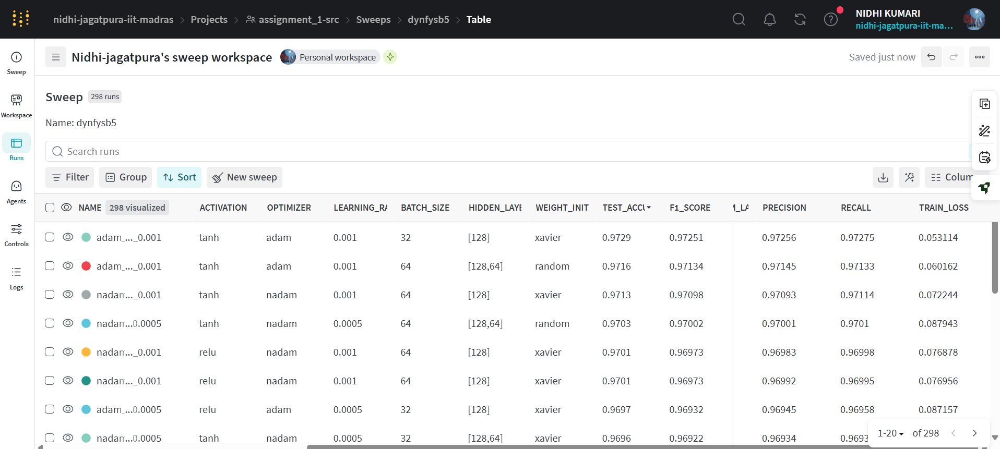
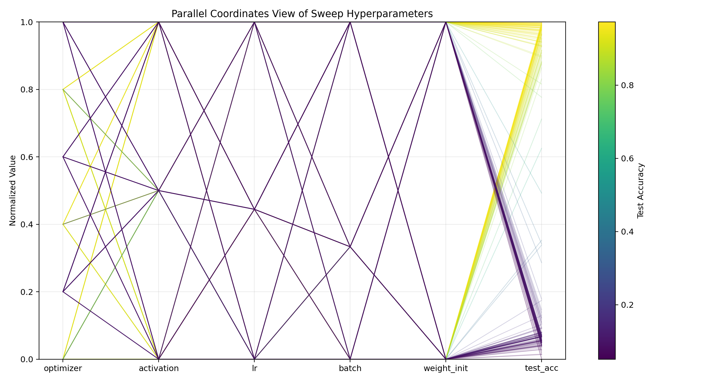
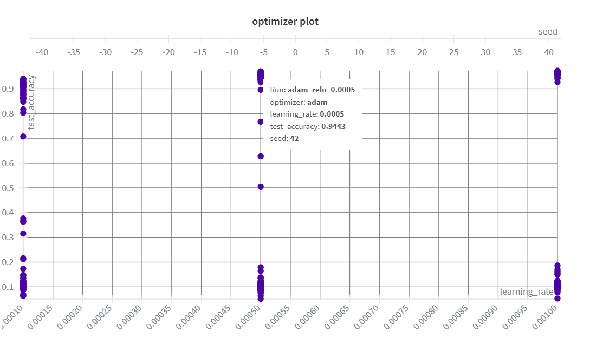
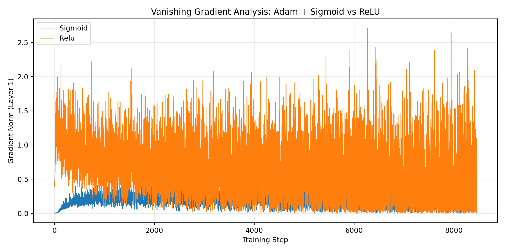
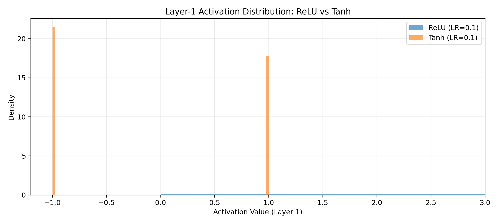
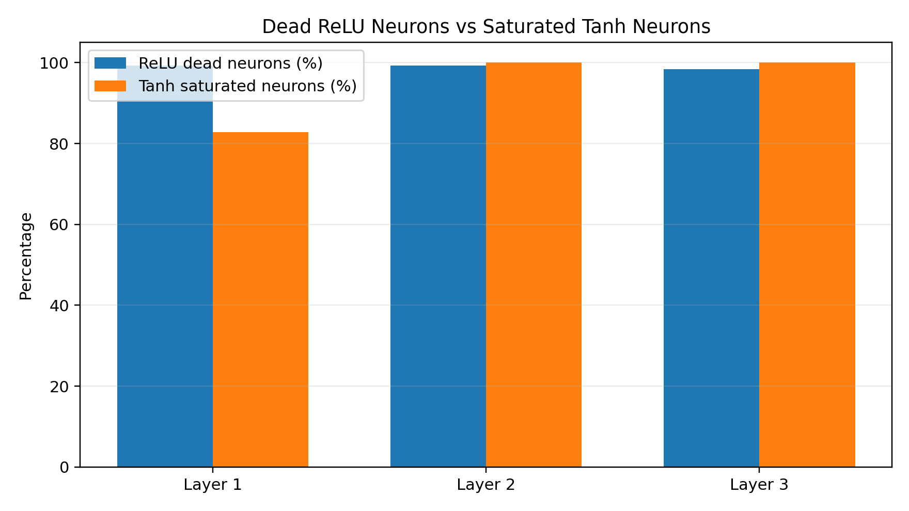
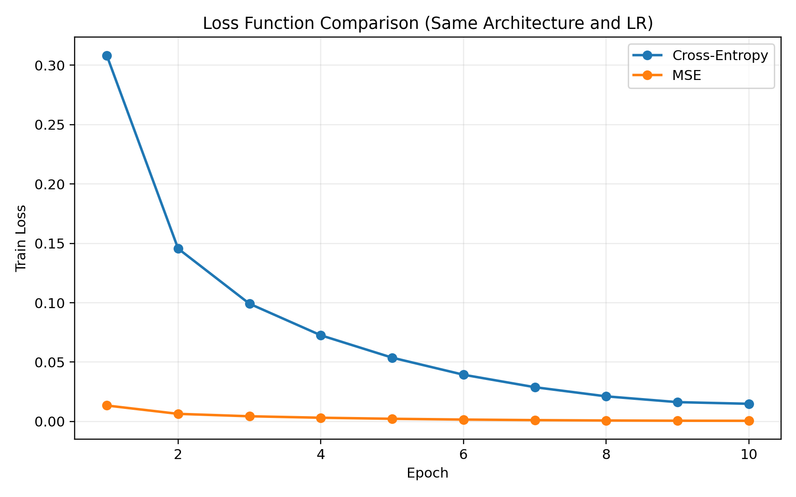
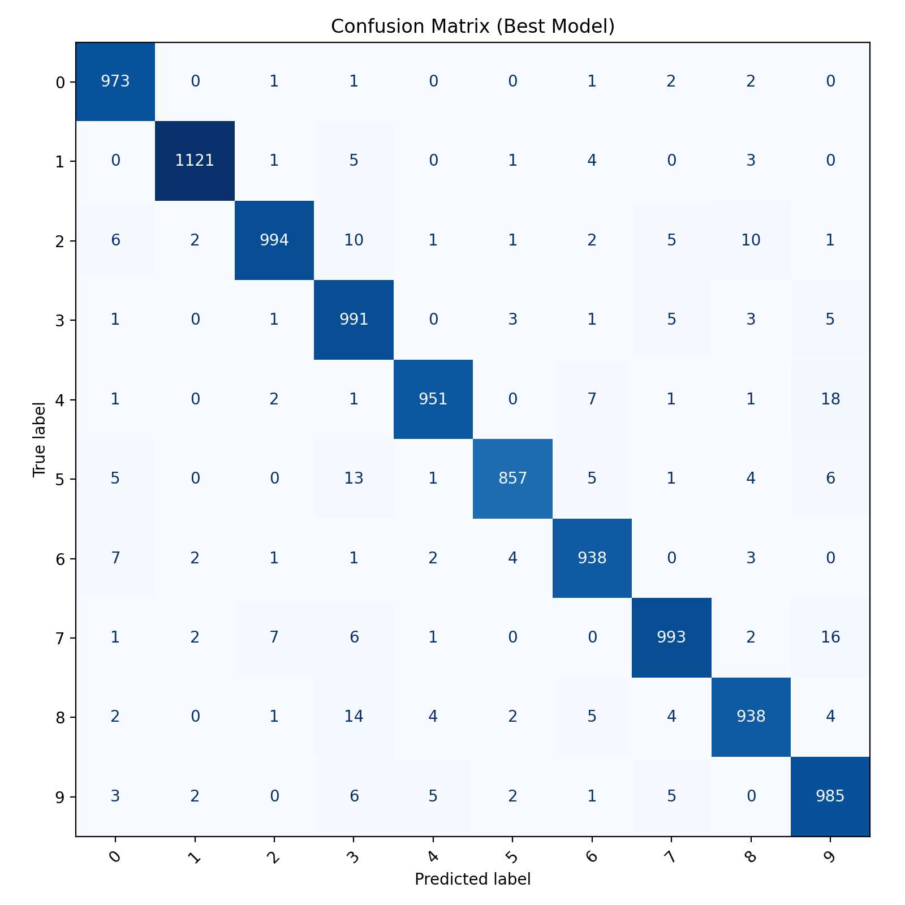
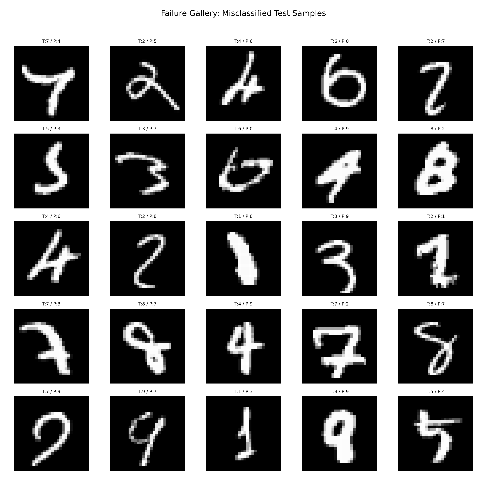
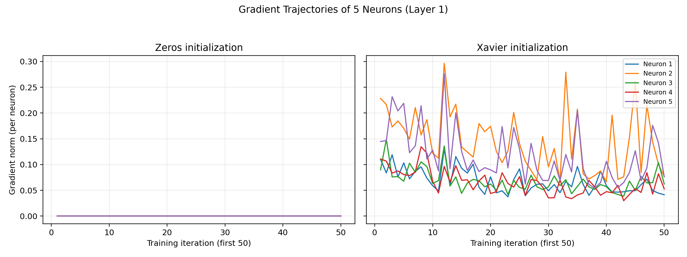

# DA6401 Assignment 1 – W&B Report Draft (Rubric-Aligned)

## Run Summary

- Dataset used for sweep: MNIST
- Sweep runs analyzed: **298** (from exported CSV)
- Best run in exported sweep CSV:
  - Optimizer: **Adam**
  - Activation: **Tanh**
  - Learning Rate: **0.001**
  - Batch Size: **32**
  - Hidden Layer Sizes: **[128]**
  - Weight Initialization: **Xavier**
  - Test Accuracy: **97.29%**
  - Precision: **97.26%**
  - Recall: **97.27%**
  - F1 Score: **97.25%**
- Latest retrained checkpoint (`models/best_model.npy`, 10 epochs with `best_config.json`):
  - Test Accuracy: **97.41%**
  - Precision: **97.42%**
  - Recall: **97.38%**
  - F1 Score: **97.39%**

---

## 2.1 Data Exploration and Class Distribution (3 Marks)

### What was done
- Logged class-wise sample images using a W&B table script.
- Source script: `src/log_dataset_samples.py`
- W&B table run: https://wandb.ai/nidhi-jagatpura-iit-madras/da6401-assignment-1/runs/jmayqt40
- Logged artifact key: `mnist_samples` (5 examples per class for all 10 classes).

### Observations
- Visually similar MNIST digits include: **3 vs 5**, **4 vs 9**, and **7 vs 1** (depending on writing style).
- This similarity can increase class confusion, especially for shallow models or under-trained configurations.

### Class-level examples from the table
- Class pairs that visually overlap most in the logged samples are **3 vs 5**, **4 vs 9**, and **7 vs 1**.
- Curved and open-stroke styles in digit **3** are frequently similar to handwritten **5**.
- Thin vertical strokes and slight hooks create confusion between **1** and **7**.
- Loop closure and tail length variation produce overlap between **4** and **9**.
- These ambiguities explain why most remaining errors concentrate on structurally similar digit pairs.

---

## 2.2 Hyperparameter Sweep (6 Marks)

### What was done
- Conducted sweep over optimizer, learning rate, activation, batch size, initialization, and hidden layer size.
- Runs completed: **298**.

### Key findings
- Best configuration in the export:
  - Adam + Tanh + LR=0.001 + Batch=32 + [128] + Xavier.
- From aggregate statistics (all runs):
  - Highest max test accuracy observed at LR=0.001.
  - Optimizer choice had the largest effect on final accuracy range.
- Parallel-coordinates interpretation (from `images/parallel_coordinates.png`):
  - The highest-accuracy lines cluster around **Adam/Nadam**, **Tanh**, and **LR=0.001**.
  - **LR** and **optimizer** cause the clearest separations in the top-accuracy trajectories.
  - `weight_init=xavier` appears more often in the top-accuracy region than `random`.

### Dominant hyperparameter conclusion
- The dominant hyperparameter in this sweep is **learning rate**, with **0.001** consistently associated with the best-performing runs; optimizer choice is the next strongest factor.

---

## 2.3 The Optimizer Showdown (5 Marks)

### Controlled experiment setup
- Architecture: **3 hidden layers**, each with **128 neurons**
- Activation: **ReLU**
- Dataset: **MNIST**
- Epochs: **5**
- Batch size: **64**
- Learning rate: **0.001**
- Weight initialization: **Xavier**
- Loss: **Cross-Entropy**

### Results (5-epoch comparison)

| Optimizer | Test Accuracy | Precision | Recall | F1 Score | W&B Run |
|---|---:|---:|---:|---:|---|
| SGD | 84.90% | 84.64% | 84.58% | 84.48% | https://wandb.ai/nidhi-jagatpura-iit-madras/assignment_1-optimizer_showdown/runs/6uj8kfo9 |
| Momentum | 82.03% | 81.77% | 81.54% | 81.30% | https://wandb.ai/nidhi-jagatpura-iit-madras/assignment_1-optimizer_showdown/runs/r5t9uc19 |
| NAG | 84.85% | 84.62% | 84.54% | 84.47% | https://wandb.ai/nidhi-jagatpura-iit-madras/assignment_1-optimizer_showdown/runs/kifow1t0 |
| RMSProp | 97.12% | 97.09% | 97.11% | 97.09% | https://wandb.ai/nidhi-jagatpura-iit-madras/assignment_1-optimizer_showdown/runs/33jrtqv4 |
| Adam | 96.84% | 96.88% | 96.80% | 96.81% | https://wandb.ai/nidhi-jagatpura-iit-madras/assignment_1-optimizer_showdown/runs/zqmjohj5 |
| Nadam | 97.44% | 97.43% | 97.42% | 97.42% | https://wandb.ai/nidhi-jagatpura-iit-madras/assignment_1-optimizer_showdown/runs/ccyb7j1y |

### Inference
- Adaptive optimizers (**RMSProp, Adam, Nadam**) strongly outperform SGD-family variants in this controlled setup.
- Best **final 5-epoch accuracy** is obtained by **Nadam (97.44%)**.
- Using end-of-epoch loss trend and final batch-loss values, **RMSProp/Nadam** converge fastest in this setting, while Momentum lags.

### Theoretical explanation
- Adam/Nadam combine momentum with adaptive per-parameter scaling, making updates robust under noisy and anisotropic gradients.
- This typically yields faster and more stable optimization than vanilla SGD for image classification tasks.

---

## 2.4 Vanishing Gradient Analysis (5 Marks)

### Controlled experiment setup
- Optimizer fixed to: **Adam**
- Dataset: **MNIST**
- Epochs: **10**
- Batch size: **64**
- Learning rate: **0.001**
- Architecture: **4 hidden layers**, each of size **128**
- Loss: **Cross-Entropy**
- Initializer: **Xavier**
- Compared activations: **Sigmoid vs ReLU**

### Results

| Activation | Test Accuracy | Precision | Recall | F1 Score | W&B Run |
|---|---:|---:|---:|---:|---|
| Sigmoid | 96.73% | 96.73% | 96.71% | 96.70% | https://wandb.ai/nidhi-jagatpura-iit-madras/assignment_1-vanishing/runs/xm3n9rr4 |
| ReLU | 97.89% | 97.88% | 97.87% | 97.87% | https://wandb.ai/nidhi-jagatpura-iit-madras/assignment_1-vanishing/runs/pmbjh764 |

Gradient norm statistics for first hidden layer (`grad_norm_layer1`):
- Sigmoid: mean = **0.2237**, median = **0.2168**
- ReLU: mean = **0.6538**, median = **0.6292**

### Interpretation
- Sigmoid exhibits systematically lower gradient norms than ReLU across training steps, indicating weaker gradient flow.
- This aligns with the vanishing-gradient tendency of Sigmoid due to saturation.
- ReLU maintains stronger gradient propagation and also achieves better final accuracy in this controlled setup.

### Theoretical explanation
- For Sigmoid, derivatives are bounded by 0.25 and quickly become very small in saturated regions, causing gradients to shrink through depth.
- ReLU has derivative 1 in active regions, reducing multiplicative attenuation and improving optimization in deeper MLPs.

---

## 2.5 Dead Neuron Investigation (6 Marks)

### Controlled experiment setup
- Dataset: **MNIST**
- Optimizer: **Adam**
- Learning rate: **0.1** (intentionally high)
- Architecture: **3 hidden layers**, each with **128 neurons**
- Epochs: **10**
- Batch size: **64**
- Loss: **Cross-Entropy**
- Initializer: **Xavier**
- Compared activations: **ReLU vs Tanh**

### Run outcomes

| Activation | Test Accuracy | Precision | Recall | F1 Score | W&B Run |
|---|---:|---:|---:|---:|---|
| ReLU (LR=0.1) | 37.39% | 29.70% | 37.11% | 31.81% | https://wandb.ai/nidhi-jagatpura-iit-madras/assignment_1-dead_neuron/runs/924j5zk3 |
| Tanh (LR=0.1) | 10.10% | 1.01% | 10.00% | 1.83% | https://wandb.ai/nidhi-jagatpura-iit-madras/assignment_1-dead_neuron/runs/43a2v1xm |

### Neuron-level evidence
From `images/dead_neuron_summary.json`:
- ReLU dead neurons (% per hidden layer):
  - Layer 1: **99.22%**
  - Layer 2: **99.22%**
  - Layer 3: **98.44%**
- Tanh saturated neurons (% per hidden layer, \\(|a|>0.99\\) for >95% inputs):
  - Layer 1: **82.81%**
  - Layer 2: **100.00%**
  - Layer 3: **100.00%**

### Interpretation
- In the ReLU high-LR run, validation performance plateaus at a low value and nearly all neurons become inactive (output zero almost always), indicating severe **dead neuron** collapse.
- In the Tanh high-LR run, neurons are not dead in the ReLU sense, but they saturate strongly near \\(\pm 1\\), which also harms gradient flow and leads to optimization failure.
- This explains why both high-LR runs degrade, with Tanh collapsing even more severely under this setting.

---

## 2.6 Loss Function Comparison (4 Marks)

### Controlled experiment setup
- Dataset: **MNIST**
- Optimizer: **Adam**
- Activation: **Tanh**
- Architecture: **[128, 64]**
- Epochs: **10**
- Batch size: **64**
- Learning rate: **0.001**
- Weight initialization: **Xavier**
- Only variable changed: **loss function** (`cross_entropy` vs `mse`)

### Results

| Loss Function | Test Accuracy | Precision | Recall | F1 Score | W&B Run |
|---|---:|---:|---:|---:|---|
| Cross-Entropy | 97.54% | 97.54% | 97.52% | 97.52% | https://wandb.ai/nidhi-jagatpura-iit-madras/assignment_1-loss_compare/runs/obld36as |
| MSE | 97.35% | 97.34% | 97.33% | 97.33% | https://wandb.ai/nidhi-jagatpura-iit-madras/assignment_1-loss_compare/runs/ivumgb8q |

Training-curve observation (from plotted `train_loss`):
- Cross-Entropy: `train_loss` from **0.3082 → 0.0149**
- MSE: `train_loss` from **0.0135 → 0.00061**

### Interpretation
- Both losses can train the model to high performance under this setup, but **Cross-Entropy gives better final classification metrics**.
- Raw numerical loss magnitudes are not directly comparable between CE and MSE because they optimize different objective scales.
- For multi-class classification with Softmax outputs, the practical criterion is classification performance (Accuracy/F1), where CE is better here.

### Why Cross-Entropy is better suited (theory)
- Cross-Entropy directly maximizes log-likelihood of the correct class and yields gradients aligned with probability calibration.
- With Softmax, CE provides stronger and more informative gradients for class discrimination than MSE.
- MSE treats the problem more like regression on one-hot targets, which is usually less effective for probabilistic multi-class separation.

---

## 2.7 Global Performance Analysis (4 Marks)

### What was analyzed
- A fresh controlled global set was run in W&B project:
  - https://wandb.ai/nidhi-jagatpura-iit-madras/assignment_1-global_strict
- Total runs analyzed with strict metrics: **8**
- Each run logs both **train_accuracy** and **test_accuracy**, enabling strict rubric-compliant overlay.
- Generated strict artifacts:
  - `images/global_performance_overlay_strict.png`
  - `images/global_overfit_candidates_strict.json`

### Observations
- Mean train accuracy across runs: **82.04%**
- Mean test accuracy across runs: **81.75%**
- Mean generalization gap: **0.29%**
- Largest train-test gaps in this strict set:
  - `adam_relu_0.001` (run `376o4tek`): train 98.29%, test 97.28%, gap 1.01%
  - `nadam_relu_0.001` (run `o8mikwzf`): train 97.46%, test 96.53%, gap 0.93%
  - `adam_tanh_0.001` (run `r53yn89u`): train 97.22%, test 96.46%, gap 0.76%

### Interpretation
- Runs with stronger fit show a measurable positive train-test gap, indicating mild overfitting risk even when test accuracy is high.
- In this strict run set, high-capacity ReLU/Adaptive-optimizer configurations produce the clearest generalization gap.
- The gap magnitude is modest overall, suggesting acceptable generalization for most configurations in this range.

### Supplementary historical context
- The original 298-run export is still retained for broader trend analysis via proxy-based view:
  - `images/global_performance_overlay.png`
  - `images/global_overfit_candidates.json`

---

## 2.8 Error Analysis (5 Marks)

Generated artifacts:
- Confusion matrix: 
- Failure gallery (creative visualization): 

### Interpretation template
- The confusion matrix identifies most frequent misclassification pairs.
- The failure gallery shows representative hard examples and supports qualitative error diagnosis (ambiguous handwriting, low-contrast strokes, atypical shapes).

### Note
- These figures were regenerated from the latest retrained `models/best_model.npy` checkpoint.

---

## 2.9 Weight Initialization & Symmetry (7 Marks)

### Controlled experiment setup
- Dataset: **MNIST**
- Optimizer: **Adam**
- Architecture: **[128, 64]**, activation **Tanh**
- Epochs: **1** (enough to capture first 50 iterations)
- Batch size: **64**, learning rate: **0.001**
- Compared initializations:
  1. **Zeros** (`-wi zeros`)
  2. **Xavier** (`-wi xavier`)

Run links:
- Zeros: https://wandb.ai/nidhi-jagatpura-iit-madras/assignment_1-init_symmetry/runs/v8kpb5qy
- Xavier: https://wandb.ai/nidhi-jagatpura-iit-madras/assignment_1-init_symmetry/runs/6xsrihcp

### Gradient-line evidence (first 50 iterations)
- In the **Zeros** run, the gradient traces for neurons 1–5 overlap at (near) identical values (here, effectively 0 throughout), showing perfect symmetry.
- In the **Xavier** run, the five neuron traces are distinct and non-overlapping, indicating broken symmetry and differentiated learning signals.

### Explanation of symmetry failure
- With zero initialization, neurons in the same layer start identically and receive identical gradients.
- Hence all neurons remain functionally identical during updates, preventing specialization into distinct features.
- Even if loss changes slightly, the layer acts like many copies of one neuron, limiting representation power.

### Why symmetry breaking is mathematically necessary
- MLPs rely on neurons learning different directions in parameter space.
- Randomized initialization (e.g., Xavier) creates initial parameter diversity so gradients differ per neuron.
- This diversity enables feature disentanglement, richer hidden representations, and effective optimization.

---

## 2.10 Fashion-MNIST Transfer Challenge (5 Marks)

### Selected 3 configurations (from MNIST learnings)
1. **Adam + Tanh + [128, 64]**
2. **Nadam + ReLU + [128, 64]**
3. **RMSProp + Tanh + [128, 64]**

Common settings: epochs=10, batch size=64, learning rate=0.001, loss=cross-entropy, init=xavier.

### Results on Fashion-MNIST

| Config | Test Accuracy | Precision | Recall | F1 Score | W&B Run |
|---|---:|---:|---:|---:|---|
| Adam + Tanh + [128,64] | 87.50% | 87.95% | 87.50% | 87.65% | https://wandb.ai/nidhi-jagatpura-iit-madras/assignment_1-fashion_transfer/runs/0s3se6zr |
| Nadam + ReLU + [128,64] | 87.29% | 87.66% | 87.29% | 87.36% | https://wandb.ai/nidhi-jagatpura-iit-madras/assignment_1-fashion_transfer/runs/8b2xpor7 |
| RMSProp + Tanh + [128,64] | 87.09% | 87.02% | 87.09% | 87.01% | https://wandb.ai/nidhi-jagatpura-iit-madras/assignment_1-fashion_transfer/runs/sgvopxid |

### Conclusion
- The best transfer configuration among the three is **Adam + Tanh + [128,64]** (87.50% accuracy).
- The same optimizer/activation family that worked strongly on MNIST still performs best here, but with a lower absolute accuracy than MNIST.
- This is expected because Fashion-MNIST has greater intra-class variation and stronger inter-class visual overlap (e.g., shirts/pullovers/coats), making classification harder than digit recognition.

---

## Final Submission Checklist in Report

- Public GitHub repository link: **<ADD_PUBLIC_GITHUB_REPO_URL_HERE>**
- Public W&B report/workspace link: **https://wandb.ai/nidhi-jagatpura-iit-madras/assignment_1-global_strict**

- [ ] Verify both links are public and accessible (replace W&B workspace URL with a dedicated W&B Report URL if required by rubric).
- [ ] Ensure figures in this report are from final best checkpoint.
- [ ] Ensure all 2.1–2.10 sections contain experimental evidence, not only theory.
